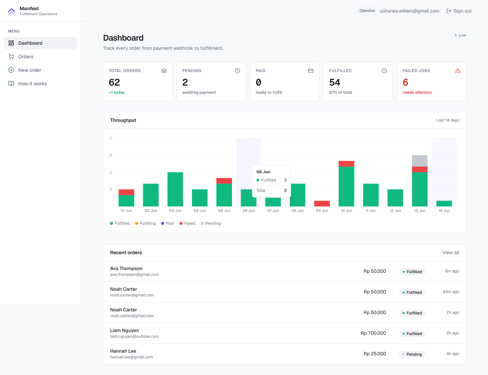
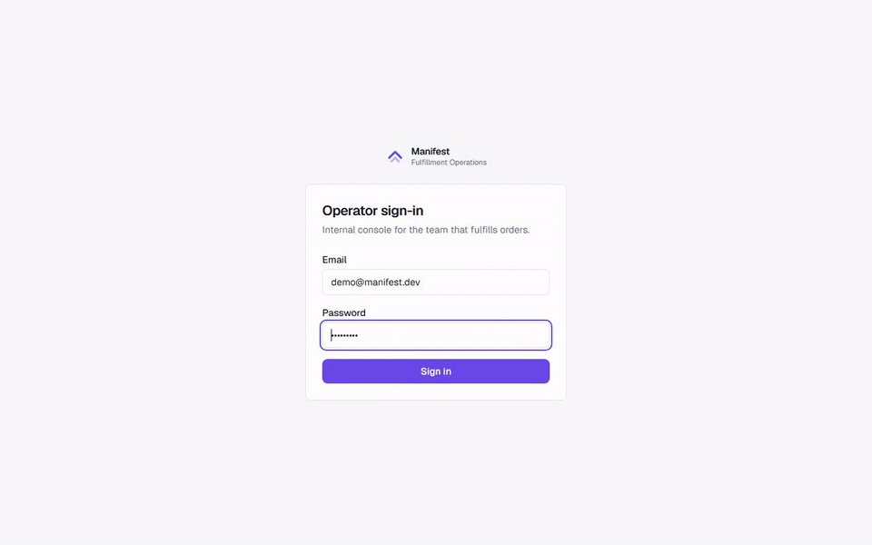
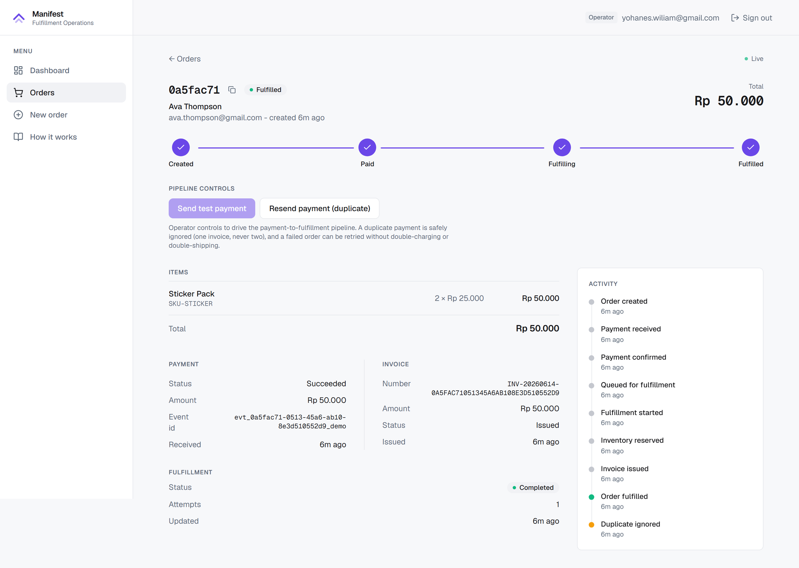
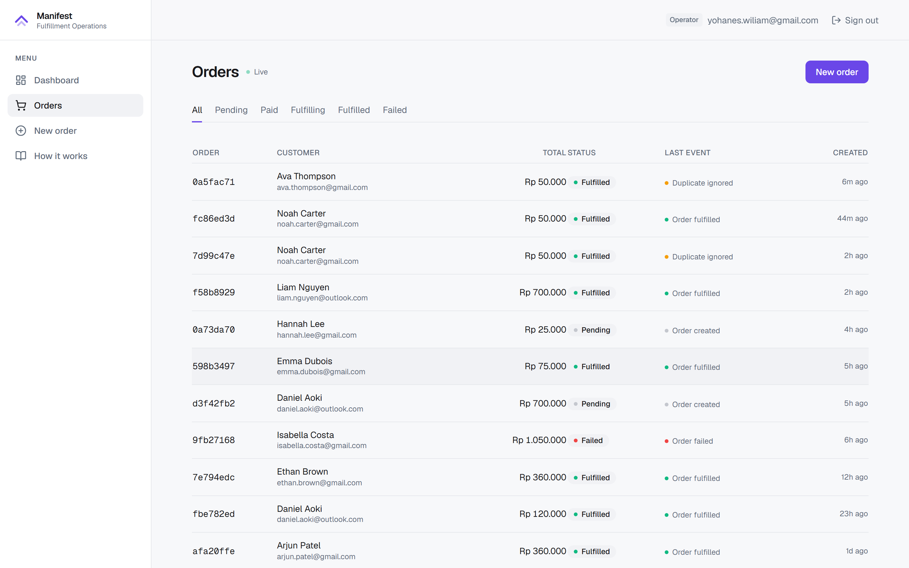
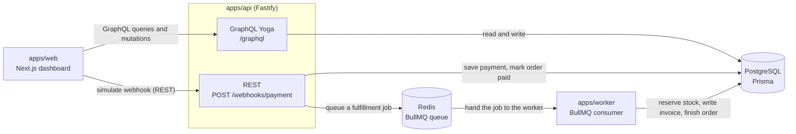
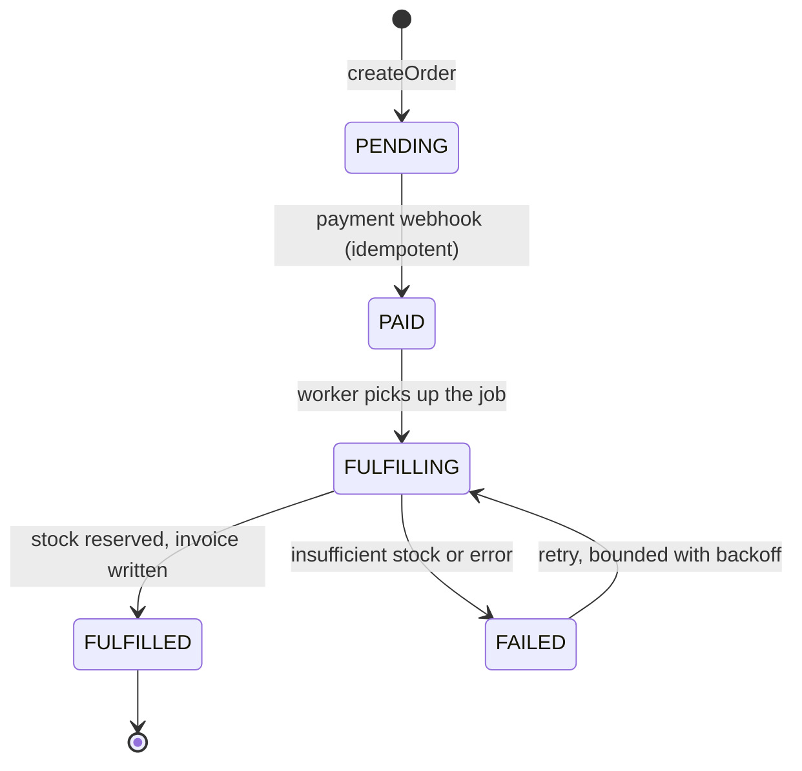

# Manifest

[](https://github.com/lixfeyzen/manifest/actions/workflows/ci.yml)
[](https://github.com/lixfeyzen/manifest/actions/workflows/e2e.yml)
[](LICENSE)


> Track every order from a payment webhook all the way to fulfillment.



[See it in action](#see-it-work) · architecture and code below

Manifest tracks an order from the moment a payment lands, through a background fulfillment queue, inventory reservation, and invoicing. The parts that usually break sit out in the open: duplicate webhooks, retries, jobs that die partway through. I built it around two questions a plain CRUD demo never has to answer. What happens when the same payment webhook shows up twice? And what happens when fulfillment fails halfway and has to run again?

---

## Highlights

- **A payment can't be charged twice.** If the payment provider sends the same webhook twice, Manifest processes it once. No double payment, no second invoice.
- **A failed order is safe to retry.** Fulfillment that fails halfway can run again with no double stock reservation and no duplicate invoice.
- **The work happens in the background.** The API answers instantly and hands the slow work to a separate worker over a queue. It's an actual queue and worker process, not a button pretending to be one.
- **Orders can't end up in an impossible state.** Every order moves through an explicit set of steps. An illegal move is rejected with a clear, typed error instead of corrupting data.

---

## See it work

There's no hosted demo. Manifest needs Postgres, Redis, and a separate worker process, so it runs locally with Docker Compose ([steps below](#running-it-locally)). The clip below is the running app, start to finish.



> Create an order → pay it through the simulated webhook → it reaches `FULFILLED` with an invoice → a second, duplicate payment changes nothing.



> Every order keeps a complete timeline — created, payment received, queued, fulfillment started, inventory reserved, invoice issued, fulfilled — each step tagged with the same correlation id.



> The orders table at a glance, with each order sitting in its current state as work moves through the queue.

---

## The hard parts

A lot of demo projects quietly skip the failure modes. A fulfillment system doesn't get to. Here are the four problems Manifest is actually built around, and how each one is enforced.

### Exactly-once webhooks under concurrency

Payment providers deliver at least once. You don't get exactly-once for free. Every webhook carries an `idempotencyKey`. Before processing, the API looks up a `ProcessedEvent` row keyed by that value, and if the row exists the event is ignored. The `ProcessedEvent` row is claimed inside the *same transaction* as the `Payment` and the order update, and its `idempotencyKey` column is `UNIQUE`. That one constraint is both the lookup key and the race guard. When two duplicate deliveries run at the same time, both pass the initial lookup, but only one `INSERT` wins. The other loses with a Prisma `P2002` and gets handled as a duplicate. The decision itself is a pure function, unit-tested on its own without a database. ([ADR 001](docs/adr/001-idempotency.md))

### Retries that are safe to run twice

BullMQ retries fulfillment jobs with bounded exponential backoff, so the worker has to survive running more than once. Before each side effect it checks whether that step already happened: is there a reservation, is there an invoice, is the order already `FULFILLED`. Two database-level unique constraints handle this. `InventoryReservation(orderId, sku)` allows one reservation per order and SKU, and `Invoice(orderId)` allows one invoice per order, so a resumed job can't double-reserve stock or write a second invoice. A permanent problem like insufficient stock gets wrapped in an `UnrecoverableError` so BullMQ stops retrying, the order is marked `FAILED`, and the transaction rolls back the stock.

### A genuine queue-and-worker split

The API saves the request, enqueues a job, and answers right away. A separate `apps/worker` process pulls the job from Redis and does the slow work. The enqueue happens *after* the database transaction commits, so a crash in that window leaves an order `PAID` but unqueued. A reconciliation sweep re-queues orders left `PAID` or `FULFILLING` past a cutoff with a fresh job id, so a lost job never strands an order.

### An explicit state machine

An order moves through a small state machine in the pure domain layer. Every transition is checked, and an invalid one throws a typed `InvalidOrderTransitionError` instead of writing a nonsensical row. The state machine is also guarded against concurrent transitions. The database update only fires when the order is still in the expected status, so two callers racing the same order can't both win.

---

## Architecture

Three deployable apps and a few shared packages in a pnpm + Turborepo monorepo. The API is one HTTP server with two surfaces (REST for the webhook, GraphQL for the dashboard). The worker is a separate process. Correctness leans on Postgres constraints and a pure domain package.



An order runs through a small, explicit state machine. Every move is checked, and an illegal move throws a typed error instead of quietly corrupting data.



The full write-up is in [docs/architecture.md](docs/architecture.md).

---

## How each idea lives in the code

A short map of the ideas behind the project and where each one lives.

| Topic               | How it works here                                                                                                                                                                    | Where to look                                                                                                                         |
| ------------------- | ------------------------------------------------------------------------------------------------------------------------------------------------------------------------------------ | ------------------------------------------------------------------------------------------------------------------------------------- |
| Event-driven design | The API saves the request, drops a job on a queue, and answers right away. A separate worker picks the job up a moment later and does the slow part.                                 | apps/api, Redis, apps/worker                                                                                                          |
| Idempotency         | Every payment event carries an idempotency key. Processed keys are stored in a `ProcessedEvent` table, and a unique index settles the case where two copies arrive at the same time. | [webhook-service.ts](apps/api/src/services/webhook-service.ts), [ADR 001](docs/adr/001-idempotency.md)                                |
| Safe retries        | Before each step the worker asks itself "did I already do this?", and unique constraints make sure a retry can never reserve stock twice or write a second invoice.                  | [fulfillment-processor.ts](apps/worker/src/fulfillment-processor.ts)                                                                  |
| Domain logic        | The business rules sit in a small package with no database or network access, which keeps them quick to test and hard to break by accident.                                          | [packages/domain](packages/domain)                                                                                                    |
| REST or GraphQL     | The webhook is one machine talking to another, so it stays REST. The dashboard asks for many shapes of data, so it leans on GraphQL.                                                 | [ADR 002](docs/adr/002-graphql-and-rest.md)                                                                                           |
| Security            | HMAC-signed webhooks (constant-time), bcrypt with signed httpOnly cookie sessions, per-route rate limiting, security headers, and GraphQL depth limiting.                            | [webhook.ts](apps/api/src/rest/webhook.ts), [auth-service.ts](apps/api/src/services/auth-service.ts), [ADR 004](docs/adr/004-auth.md) |
| Testing             | Unit tests for the rules, integration tests against a real database, and a Playwright run that clicks through the whole flow. All of it runs in CI.                                  | packages/domain, apps, tests/e2e                                                                                                      |
| Tracing             | One correlation id follows an order across the API, the queue and the worker, and shows up on every log line and event.                                                              | Pino logs, OrderEvent.correlationId                                                                                                   |

If you would rather read than run, [docs/learning-guide.md](docs/learning-guide.md) walks through the main flows line by line.

---

## Tech stack

| Layer                      | Choice                                |
| -------------------------- | ------------------------------------- |
| Language                   | TypeScript (strict)                   |
| Monorepo                   | pnpm workspaces and Turborepo         |
| Frontend                   | Next.js (App Router), React, Tailwind |
| REST API                   | Fastify                               |
| GraphQL API                | GraphQL Yoga                          |
| ORM                        | Prisma                                |
| Database                   | PostgreSQL                            |
| Queue                      | BullMQ on Redis                       |
| Validation                 | Zod                                   |
| Logging                    | Pino, with correlation ids            |
| Unit and integration tests | Vitest                                |
| End-to-end tests           | Playwright                            |
| Local infra                | Docker Compose (Postgres and Redis)   |
| CI                         | GitHub Actions                        |

---

## Quality and rigor

**85 automated checks run in CI, and both workflows are green:** 78 unit and integration tests with Vitest (domain-rule unit tests, API integration tests against a real database, and worker fulfillment tests) plus 7 Playwright end-to-end tests, including an accessibility pass. The [CI workflow](https://github.com/lixfeyzen/manifest/actions/workflows/ci.yml) is green and the separate [E2E workflow](https://github.com/lixfeyzen/manifest/actions/workflows/e2e.yml) is green.

The bugs that matter are the ones you never hit on the happy path, so each guarantee has a test pinning it down.

| Invariant                                                    | The risk                                                                    | How it is enforced                                                                                                 | Test                                                                        |
| ------------------------------------------------------------ | --------------------------------------------------------------------------- | ------------------------------------------------------------------------------------------------------------------ | --------------------------------------------------------------------------- |
| A duplicate payment webhook is a no-op                       | The provider re-delivers the same event, risking a double charge or invoice | A `ProcessedEvent` row keyed by the idempotency key; duplicates are ignored ([ADR 001](docs/adr/001-idempotency.md)) | `apps/api/test/webhook.integration.test.ts`                                 |
| Two identical webhooks racing in parallel still process once | Retries can arrive concurrently, not in sequence                            | A unique index makes the second insert lose with a `P2002` and be handled as a duplicate                           | `webhook.integration.test.ts` (concurrent identical webhooks)               |
| Stock is never oversold                                      | Two orders race for the last unit in inventory                              | An atomic guarded update (`stock >= qty` in the `WHERE`), so the database refuses to go negative                   | `apps/worker/test/fulfillment.integration.test.ts` (race for the last unit) |
| A retry never double-reserves or double-bills                | A worker crashes after reserving stock but before finishing                 | Unique `(orderId, sku)` reservation and one invoice per order; a resumed job respects existing reservations         | `fulfillment.integration.test.ts` (resuming an interrupted order)           |
| A failed job fails cleanly, not forever                      | Insufficient stock or a transient error                                     | Bounded BullMQ retries, then a permanent failure that rolls back stock                                             | `apps/worker/test/worker-queue.integration.test.ts`                         |
| A transient failure retries, then succeeds                   | A blip (a DB hiccup or network glitch) should not fail an order             | A plain error triggers bounded BullMQ backoff; the retry runs the idempotent fulfillment to completion             | `apps/worker/test/worker-retry.integration.test.ts`                         |
| A lost or stuck job is recovered                             | The API commits the order but crashes before enqueuing the job              | A reconciliation sweep re-queues orders left paid or fulfilling past a cutoff, with a fresh job id                  | `apps/worker/test/reconcile.integration.test.ts`                            |
| Forged webhooks are rejected                                 | A public endpoint invites spoofing                                          | HMAC-SHA256 verified (constant-time) before the body is parsed                                                      | `webhook-validation.integration.test.ts`                                    |

**A pure domain layer.** The business rules — the state machine, the idempotency decision, the stock math, invoice numbering — live in `packages/domain` with no database or network access. That keeps them fast to test and hard to break by accident, and it is the most heavily unit-tested package in the repo.

**Decisions are written down.** Five [Architecture Decision Records](docs/adr) explain the choices that needed defending: [idempotency](docs/adr/001-idempotency.md), [REST vs GraphQL](docs/adr/002-graphql-and-rest.md), [BullMQ on Redis](docs/adr/003-bullmq-redis.md), [auth](docs/adr/004-auth.md), and [authorization](docs/adr/005-authorization.md). There is more on the test approach in [docs/testing-strategy.md](docs/testing-strategy.md).

**Security.** Payment webhooks are HMAC-SHA256 signed and verified with a constant-time compare *before* the body is parsed. Staff sessions use bcrypt password hashing behind a signed, httpOnly session cookie with an env-aware `SameSite` policy (`Lax` in development, `None`+`Secure` in production), checked on every GraphQL request. Routes are rate-limited per endpoint, baseline security headers are set, GraphQL queries are depth-, alias-, and token-limited, and environment validation fails fast. It refuses to start in production with development secrets. One correlation id follows an order across the API, the queue, and the worker, so a single flow can be traced end to end.

### Review and hardening

I put the codebase through a multi-pass review focused on concurrency, data integrity, and security, the same way I'd review a teammate's pull request. Each finding got fixed and paired with a test: guarding the order state machine against concurrent transitions, making invoice numbers collision-free, adding crash-recovery for lost jobs, validating payment amounts, and making the session cookie and webhook secret fail safely by environment, among others. CI and the E2E suite stayed green afterward.

---

## Running it locally

You'll need Node 20 or newer, pnpm 9 or newer, and Docker. There's no hosted demo: the app needs Postgres, Redis, and a separate worker process, so it runs locally with Docker Compose.

```bash
# 1. Install dependencies
pnpm install

# 2. Copy environment variables
cp .env.example .env

# 3. Start Postgres and Redis
docker compose up -d

# 4. Run database migrations
pnpm db:migrate

# 5. Seed inventory and the demo account
pnpm db:seed

# 6. Start web, api and worker together
pnpm dev
```

Once everything is up:

- Web: http://localhost:3001
- API: http://localhost:4000
- GraphQL playground: http://localhost:4000/graphql

The dashboard sits behind a staff login. On a fresh clone the seed creates an account you can use straight away:

- Email: `demo@manifest.dev`
- Password: `fulfillment`

From there, create an order from a seeded product, click **Send test payment** and watch it move from `PENDING` to `PAID` to `FULFILLED` with an invoice. Then click **Resend payment (duplicate)** and confirm nothing changes. The webhook is genuinely HMAC-signed; [docs/learning-guide.md](docs/learning-guide.md) shows how to sign and replay one by hand with `curl`.

| Command           | What it does                               |
| ----------------- | ------------------------------------------ |
| `pnpm dev`        | Run web, api and worker together (Turbo)   |
| `pnpm build`      | Build all packages and apps                |
| `pnpm test`       | Run unit and integration tests (Vitest)    |
| `pnpm test:e2e`   | Run the Playwright end-to-end tests        |
| `pnpm lint`       | Lint everything                            |
| `pnpm typecheck`  | Type-check the whole monorepo              |
| `pnpm db:migrate` | Apply Prisma migrations                    |
| `pnpm db:seed`    | Seed inventory items and the demo account  |
| `pnpm db:studio`  | Open Prisma Studio                         |

---

## Trade-offs and what's next

A few things are deliberately out of scope:

- **No hosted demo yet.** The full stack (Postgres, Redis, a separate worker) runs locally with Docker Compose, so the recording above is what you get instead of a live link. Deploying the whole stack is the natural next step.
- **No real payment provider.** Payments arrive through the same HMAC-signed REST webhook a provider would call, triggered here by a button instead of Stripe.
- **Invoice numbers are derived from the order id** (`INV-YYYYMMDD-<order-uuid>`). That makes them collision-free by construction, but long and unfriendly. A production finance team would probably want a short sequential number and a real document (a PDF or an email), not just a database row.
- **Single-operator auth.** Authentication is authorization here; there are no roles. What a multi-tenant, role-based version would take is written up in [ADR 005](docs/adr/005-authorization.md).
- **One worker.** Scaling out to many workers is sound given the idempotent design, but this version doesn't exercise it.
- **Invoices are database records only.** Nothing turns them into a PDF or an email yet.

---

## About and contact

I built Manifest as a portfolio project to show how I handle the parts of a real system that tend to break: the duplicate webhook, the half-finished job, the retry, and how I test them. I built it with AI assistance, and I reviewed, ran, and tested every change before it landed. The workflow and guardrails are in [docs/ai-workflow.md](docs/ai-workflow.md). Happy to talk through any of it.

**Yohanes Wiliam Hadiprojo**

- Email: wiliamyohanes932@gmail.com
- GitHub: [github.com/lixfeyzen](https://github.com/lixfeyzen)
- LinkedIn: [linkedin.com/in/yohaneswiliam](https://www.linkedin.com/in/yohaneswiliam)
- Repo: [github.com/lixfeyzen/manifest](https://github.com/lixfeyzen/manifest)
