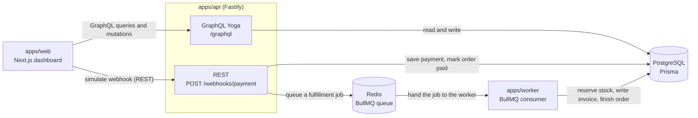
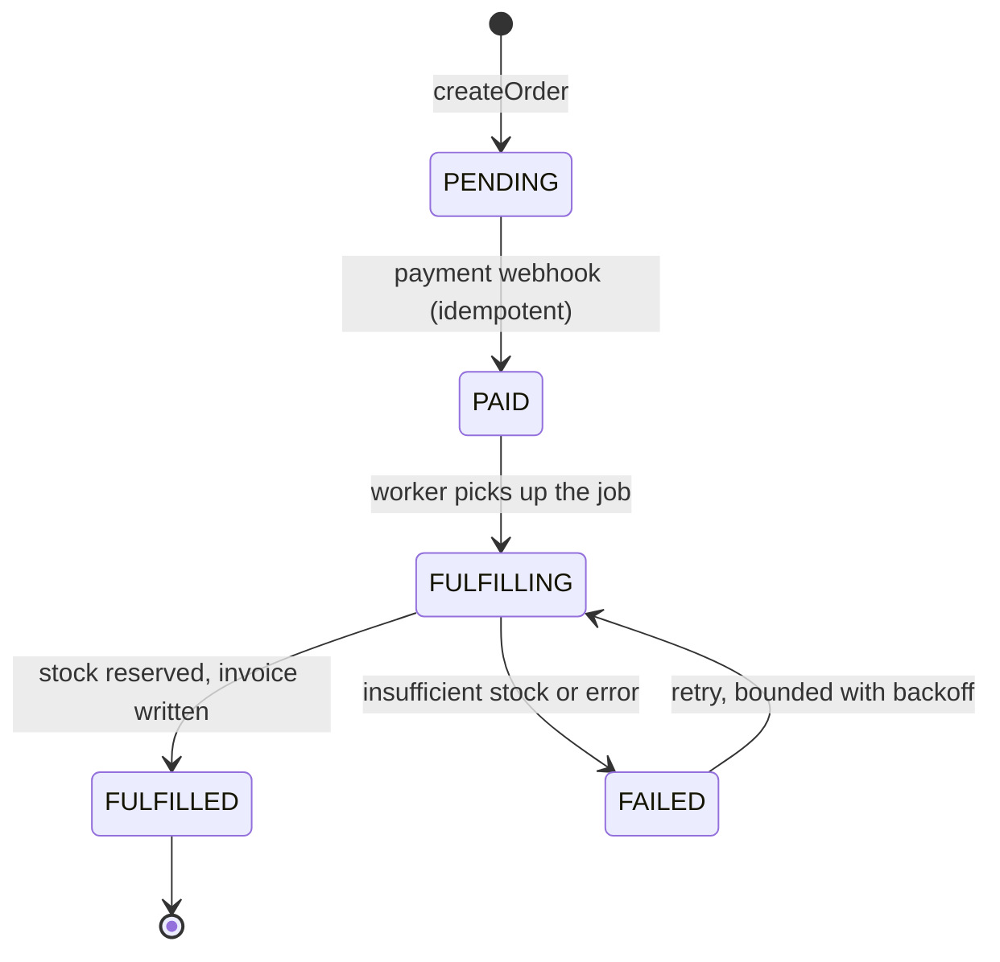

# Manifest

[](https://github.com/lixfeyzen/manifest/actions/workflows/ci.yml)
[](https://github.com/lixfeyzen/manifest/actions/workflows/e2e.yml)
[](LICENSE)


> Track every order from a payment webhook all the way to fulfillment.

Manifest is a dashboard for the operations side of order fulfillment. It picks an order up the moment it's created, follows it through the payment webhook, the background fulfillment work, the inventory reservation and the invoice, and keeps the parts that usually break quietly out of view (duplicate webhooks, retries, half-finished jobs) right where you can watch them happen.

I built it as a portfolio project to show the things a plain CRUD demo never does: a real queue with a separate worker, payment webhooks that survive being delivered twice, fulfillment that is safe to run again after a failure, and tests that check the actual business rules rather than the color of a button.

---

## What this shows

A short map of the ideas behind the project and where each one lives in the code.

| Topic               | How it works here                                                                                                                                                                    | Where to look                                                                                                                         |
| ------------------- | ------------------------------------------------------------------------------------------------------------------------------------------------------------------------------------ | ------------------------------------------------------------------------------------------------------------------------------------- |
| Event-driven design | The API saves the request, drops a job on a queue, and answers right away. A separate worker picks the job up a moment later and does the slow part.                                 | apps/api, Redis, apps/worker                                                                                                          |
| Idempotency         | Every payment event carries an idempotency key. Processed keys are stored in a `ProcessedEvent` table, and a unique index settles the case where two copies arrive at the same time. | [webhook-service.ts](apps/api/src/services/webhook-service.ts), [ADR 001](docs/adr/001-idempotency.md)                                |
| Safe retries        | Before each step the worker asks itself "did I already do this?", and unique constraints make sure a retry can never reserve stock twice or write a second invoice.                  | [fulfillment-processor.ts](apps/worker/src/fulfillment-processor.ts)                                                                  |
| Domain logic        | The business rules sit in a small package with no database or network access, which keeps them quick to test and hard to break by accident.                                          | [packages/domain](packages/domain)                                                                                                    |
| REST or GraphQL     | The webhook is one machine talking to another, so it stays REST. The dashboard asks for many shapes of data, so it leans on GraphQL.                                                 | [ADR 002](docs/adr/002-graphql-and-rest.md)                                                                                           |
| Security            | HMAC-signed webhooks (constant-time), bcrypt with signed httpOnly cookie sessions, per-route rate limiting, security headers, and GraphQL depth limiting.                            | [webhook.ts](apps/api/src/rest/webhook.ts), [auth-service.ts](apps/api/src/services/auth-service.ts), [ADR 004](docs/adr/004-auth.md) |
| Testing             | Unit tests for the rules, integration tests against a real database, and a Playwright run that clicks through the whole flow. All of it runs in CI.                                  | packages/domain, apps, tests/e2e                                                                                                      |
| Tracing             | One correlation id follows an order across the API, the queue and the worker, and shows up on every log line and event.                                                              | Pino logs, OrderEvent.correlationId                                                                                                   |

If you would rather read than run, [docs/learning-guide.md](docs/learning-guide.md) walks through the main flows line by line.

---

## Why I built it this way

Most demo projects skip the awkward questions. A real fulfillment system has to answer them:

- What happens when the payment provider sends the same webhook twice?
- What happens when fulfillment fails halfway and has to run again?
- How do you make sure stock is never reserved twice, or an order never ends up with two invoices?

The whole thing is shaped around those three questions. The logic that actually matters lives in a tested domain layer and in small, separate services, not buried inside route handlers.

---

## Architecture



An order runs through a small, explicit state machine. Every move is checked, and an illegal move throws a typed error instead of quietly corrupting data.



The full write-up is in [docs/architecture.md](docs/architecture.md).

---

## Tech stack

| Layer                      | Choice                                |
| -------------------------- | ------------------------------------- |
| Language                   | TypeScript (strict)                   |
| Monorepo                   | pnpm workspaces and Turborepo         |
| Frontend                   | Next.js (App Router), React, Tailwind |
| REST API                   | Fastify                               |
| GraphQL API                | GraphQL Yoga                          |
| ORM                        | Prisma                                |
| Database                   | PostgreSQL                            |
| Queue                      | BullMQ on Redis                       |
| Validation                 | Zod                                   |
| Logging                    | Pino, with correlation ids            |
| Unit and integration tests | Vitest                                |
| End-to-end tests           | Playwright                            |
| Local infra                | Docker Compose (Postgres and Redis)   |
| CI                         | GitHub Actions                        |

---

## Running it locally

You will need Node 20 or newer, pnpm 9 or newer, and Docker. There is no hosted demo: the app needs Postgres, Redis and a separate worker process, so it runs locally with Docker Compose.

```bash
# 1. Install dependencies
pnpm install

# 2. Copy environment variables
cp .env.example .env

# 3. Start Postgres and Redis
docker compose up -d

# 4. Run database migrations
pnpm db:migrate

# 5. Seed inventory
pnpm db:seed

# 6. Start web, api and worker together
pnpm dev
```

Once everything is up:

- Web: http://localhost:3000
- API: http://localhost:4000
- GraphQL playground: http://localhost:4000/graphql

---

## Commands

| Command           | Description                              |
| ----------------- | ---------------------------------------- |
| `pnpm dev`        | Run web, api and worker together (Turbo) |
| `pnpm build`      | Build all packages and apps              |
| `pnpm test`       | Run unit and integration tests (Vitest)  |
| `pnpm test:e2e`   | Run the Playwright end-to-end tests      |
| `pnpm lint`       | Lint everything                          |
| `pnpm typecheck`  | Type-check the whole monorepo            |
| `pnpm db:migrate` | Apply Prisma migrations                  |
| `pnpm db:seed`    | Seed inventory items                     |
| `pnpm db:studio`  | Open Prisma Studio                       |

---

## Logging in

The dashboard sits behind a staff login. Passwords are hashed with bcrypt, and the session is a signed, httpOnly cookie backed by a row in the database. The GraphQL API checks that session on every request. The payment webhook stays open on purpose, because a payment provider has no account to log in with. The reasoning is written up in [ADR 004](docs/adr/004-auth.md).

In development there is a seeded account you can use straight away:

- Email: `demo@manifest.dev`
- Password: `demo12345`

Authorization is intentionally flat: Manifest is a single-operator ops console, where authentication is authorization, so the operator sees and acts on every order (a shared fulfillment queue). Public sign-up is disabled in production; the operator account is seeded. The reasoning, and what a multi-tenant version would take, is in [ADR 005](docs/adr/005-authorization.md).

---

## Trying the full flow

1. Open http://localhost:3000 and sign in with the demo account.
2. Go to Orders, then New, and create an order using one of the seeded products.
3. On the order page the status starts at `PENDING`.
4. Click "Send test payment". The order turns `PAID` and a fulfillment job is queued.
5. The worker takes over. The order moves to `FULFILLING` and then `FULFILLED`, stock is reserved, and an invoice is written.
6. Click "Resend payment (duplicate)". Nothing changes. No second payment, no second invoice.
7. The event timeline on the right records every step, each one tagged with the same correlation id.

---

## Sending a webhook by hand

The webhook is HMAC-signed, exactly as a real payment provider would sign it: the `x-manifest-signature` header must be the SHA256 HMAC of the raw request body, keyed by `WEBHOOK_SECRET` from your `.env` (export it in your shell first). Sign one `BODY` variable and send that same variable so the bytes match.

```bash
BODY='{"eventId":"evt_001","orderId":"<ORDER_ID>","type":"payment.succeeded","amount":120000,"idempotencyKey":"payment_<ORDER_ID>_demo","correlationId":"corr_001"}'
SIG=$(printf '%s' "$BODY" | openssl dgst -sha256 -hmac "$WEBHOOK_SECRET" | awk '{print $2}')

curl -X POST http://localhost:4000/webhooks/payment \
  -H "Content-Type: application/json" \
  -H "x-manifest-signature: $SIG" \
  -d "$BODY"
```

Send the same `idempotencyKey` a second time (re-run both commands) and the API replies with `{"status":"ignored","message":"Duplicate event ignored safely"}` without touching anything. The dashboard's "Send test payment" button does this signing for you.

---

## Reliability proof

The interesting failures are the ones that never show up on the happy path. Each guarantee below is enforced in code and pinned by a test.

| Invariant                                                    | The risk                                                                    | How it is enforced                                                                                                   | Test                                                                        |
| ------------------------------------------------------------ | --------------------------------------------------------------------------- | -------------------------------------------------------------------------------------------------------------------- | --------------------------------------------------------------------------- |
| A duplicate payment webhook is a no-op                       | The provider re-delivers the same event, risking a double charge or invoice | A `ProcessedEvent` row keyed by the idempotency key; duplicates are ignored ([ADR 001](docs/adr/001-idempotency.md)) | `apps/api/test/webhook.integration.test.ts`                                 |
| Two identical webhooks racing in parallel still process once | Retries can arrive concurrently, not in sequence                            | A unique index makes the second insert lose with a P2002 and be handled as a duplicate                               | `webhook.integration.test.ts` (race-safe: concurrent identical webhooks)    |
| Stock is never oversold                                      | Two orders race for the last unit in inventory                              | An atomic guarded update (`stock >= qty` in the `WHERE`), so the database refuses to go negative                     | `apps/worker/test/fulfillment.integration.test.ts` (race for the last unit) |
| A retry never double-reserves or double-bills                | A worker crashes after reserving stock but before finishing                 | Unique `(orderId, sku)` reservation and one invoice per order; a resumed job respects existing reservations          | `fulfillment.integration.test.ts` (resuming an interrupted order)           |
| A failed job fails cleanly, not forever                      | Insufficient stock or a transient error                                     | Bounded BullMQ retries, then a permanent failure that rolls back stock                                               | `apps/worker/test/worker-queue.integration.test.ts`                         |
| A transient failure retries, then succeeds                   | A blip (a DB hiccup or network glitch) should not fail an order             | A plain error triggers bounded BullMQ backoff; the retry runs the idempotent fulfillment to completion              | `apps/worker/test/worker-retry.integration.test.ts`                         |
| A lost or stuck job is recovered                             | The API commits the order but crashes before enqueuing the job              | A reconciliation sweep re-queues orders left paid or fulfilling past a cutoff, with a fresh job id                  | `apps/worker/test/reconcile.integration.test.ts`                            |
| Forged webhooks are rejected                                 | A public endpoint invites spoofing                                          | HMAC-SHA256 verified (constant-time) before the body is parsed                                                       | `webhook-validation.integration.test.ts`                                    |

A reconciliation sweep re-queues orders that have been paid or fulfilling for too long, so a lost job never leaves an order stuck. A single correlation id ties every step together across the API, queue and worker.

---

## Testing

86 automated tests run in CI: 79 with Vitest (27 domain-rule unit tests, 45 API tests, 7 worker fulfillment tests) and 7 Playwright end-to-end tests, including an accessibility pass.

- Unit tests cover the domain layer: status transitions, fulfillment guards, the stock math, invoice numbering and the idempotency helpers.
- Integration tests run the API against a real database and check order creation, a first-time webhook, a duplicate webhook, and a retry that still reserves stock only once.
- End-to-end tests with Playwright drive the critical path through the browser.

There is more detail in [docs/testing-strategy.md](docs/testing-strategy.md).

---

## Security

Implemented: HMAC-signed webhooks (constant-time compare, verified before the body is parsed), bcrypt password hashing (cost 12), a signed httpOnly `SameSite=Lax` session cookie checked on every GraphQL request, per-route rate limiting, baseline security headers, and GraphQL depth and complexity limits.

Deliberately left for later, and called out so the boundary is honest: webhook replay/timestamp windows, secret rotation, a dedicated audit log beyond the event timeline, CSRF tokens (currently mitigated by `SameSite`), and role-based access (single-operator by design, see [ADR 005](docs/adr/005-authorization.md)).

## What it deliberately leaves out

- There is no real payment provider. Payments arrive through the same REST webhook a provider would call, triggered here by a button.
- Auth is kept simple on purpose: email and password with a cookie session, and no roles, OAuth, email verification or password reset.
- Invoices are database records only. Nothing turns them into a PDF or sends an email.
- It runs a single worker. Scaling out to many workers is not something this version worries about.

---

## A note on how it was built

I built Manifest with AI assistance, and I treated it the way you would treat any pull request from a teammate. I read every change, ran the type checker, and kept the tests green before anything landed. The goal was never to ship code I could not explain. [docs/ai-workflow.md](docs/ai-workflow.md) covers the workflow and the guardrails I held it to.
