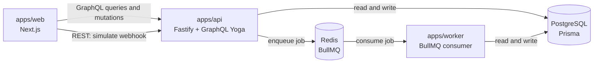
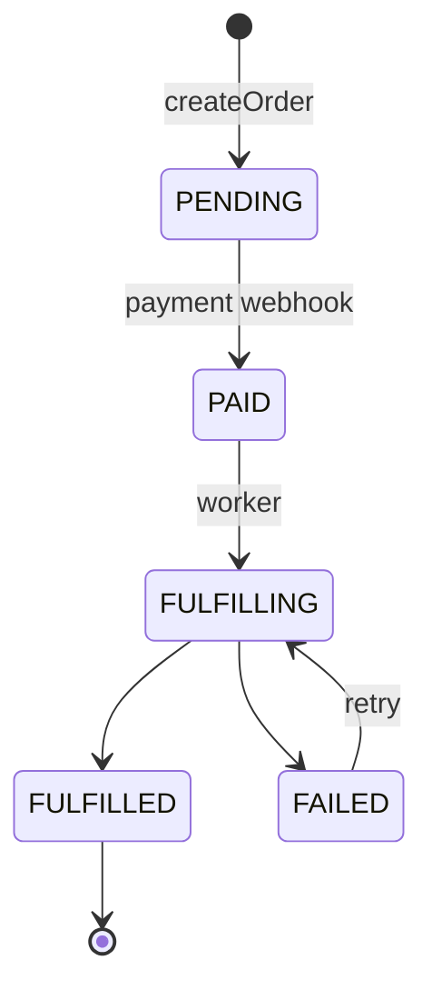

# Architecture

Manifest is a small but realistic event-driven system. It splits into three
deployable apps and three shared packages inside a pnpm and Turborepo monorepo.

## Components

### apps/web (Next.js dashboard)

It uses the App Router. Server Components fetch fresh data with `cache: 'no-store'`,
while small client "islands" handle the interactions (create an order, simulate a
webhook, retry) and refresh the view afterward. The web app keeps its own view
types and a tiny GraphQL fetch helper, so it never imports server-only code.

### apps/api (Fastify and GraphQL Yoga)

One HTTP server exposes two surfaces. The REST side handles `POST /webhooks/payment`,
which receives payment events, plus `GET /health` for liveness checks. The GraphQL
side at `/graphql` serves the dashboard queries and the `createOrder` and
`retryFulfillment` mutations.

GraphQL Yoga is mounted as an encapsulated Fastify plugin so its body parsing does
not interfere with the REST routes. Every input is validated with Zod, and the
business logic lives in `src/services`, which keeps the route handlers thin.

### apps/worker (BullMQ consumer)

It consumes fulfillment jobs from Redis. For each job it reserves inventory, issues
an invoice, and advances the order to `FULFILLED`, writing an event at every step.

### packages/db (Prisma and PostgreSQL)

This holds the schema, the migrations, the seed, and a shared `PrismaClient`. Two
database-level unique constraints carry a lot of weight for correctness. The first
is `InventoryReservation(orderId, sku)`, which allows one reservation per order and
SKU. The second is `Invoice(orderId)`, which allows one invoice per order.

### packages/domain (pure business rules)

No input or output happens here. It contains the order state machine, the
fulfillment guards, the stock math, invoice numbering, and the idempotency
decisions. This is the most heavily unit-tested package in the repo.

### packages/shared (contracts)

Enums and constants that mirror the Prisma enums, the Zod schemas, and the queue
constants. It is the single source of truth shared by the api, the worker, and the db.

## Idempotency

A payment webhook may arrive more than once. Before processing one, the API checks
for a `ProcessedEvent` row keyed by `idempotencyKey`. If a row already exists, the
event is ignored. That row is created inside the same transaction as the payment, so
its unique constraint also settles concurrent duplicates: when two copies race, the
loser gets a `P2002` error and is treated as a duplicate. There is more in
[ADR 001](adr/001-idempotency.md).

## Retry behavior

Fulfillment jobs retry three times with exponential backoff, which BullMQ handles.
The worker is written to be safe to run more than once, so each side effect first
checks whether it already happened: is there a reservation already, is there an
invoice already, is the order already `FULFILLED`. A permanent problem such as
insufficient stock is wrapped in `UnrecoverableError` so BullMQ stops retrying. When
that happens the order is marked `FAILED` and the stock is rolled back by the
transaction.

## Correlation ids

Every `OrderEvent` carries a `correlationId`, and the logs are tagged with the same
value, so a single flow can be traced across the API, the queue, and the worker.

## Order lifecycle

An invalid transition throws a typed `InvalidOrderTransitionError`.
